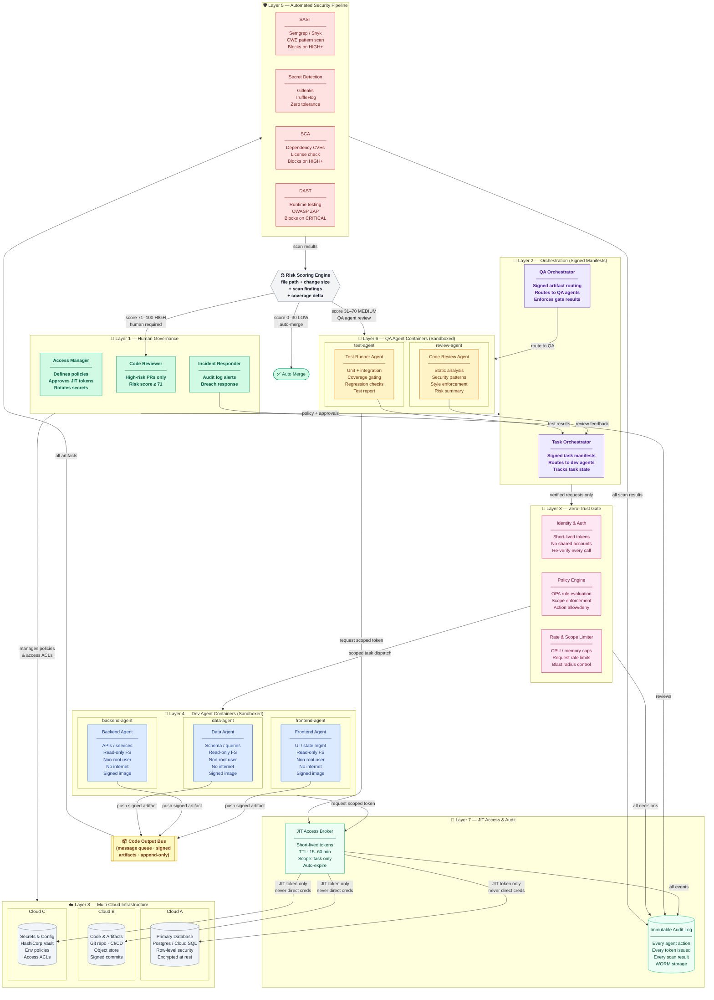
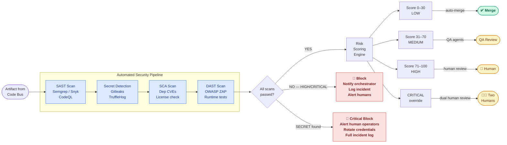
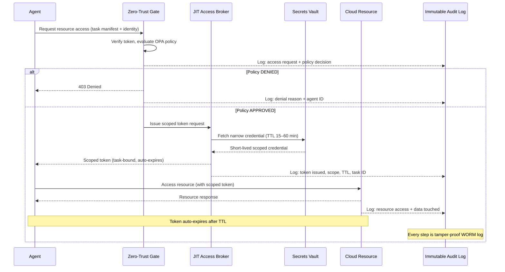
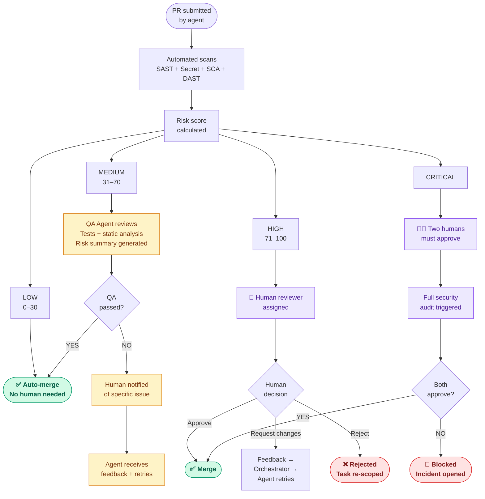
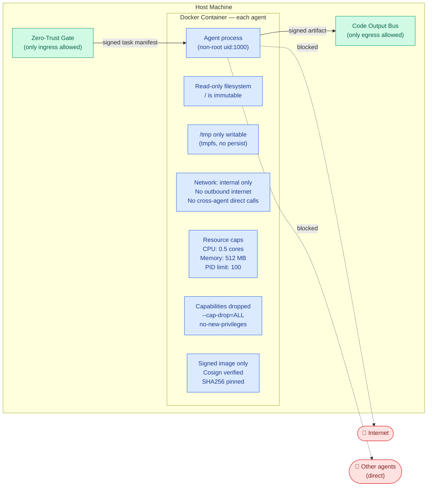
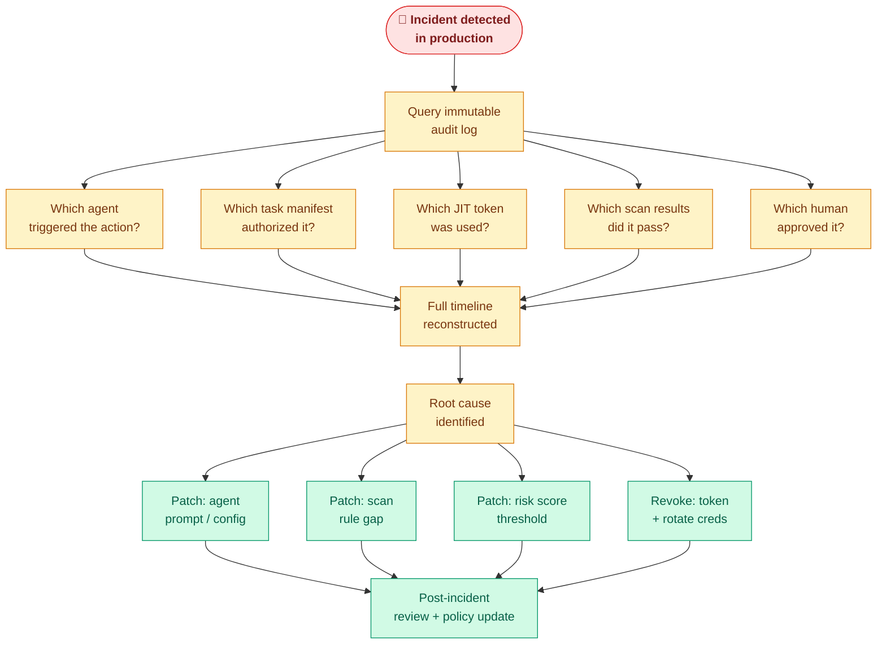

# Revised Multi-Agent Software Development Architecture
### With Security, Debugging, Human Access Control & Cloud Integration

> Paste any code block below into [https://mermaid.live](https://mermaid.live) to render it.

---

## Diagram 1 — Full System Overview

---

## Diagram 2 — Security Pipeline Detail (Layer 5)

---

## Diagram 3 — JIT Access Flow (Layer 7)

---

## Diagram 4 — Human Review Decision Flow (Layer 6)

---

## Diagram 5 — Agent Sandbox Hardening (Layer 4)

---

## Diagram 6 — Debugging Flow (Audit Trail)

---

## Architecture Component Reference

| Component | Layer | Purpose | Key Security Property |
|---|---|---|---|
| Human operators | 1 | Policy, approvals, incidents | Only humans can override gates |
| Task orchestrator | 2 | Routes work via signed manifests | Agents only act on verified instructions |
| QA orchestrator | 2 | Routes artifacts to QA | Artifact integrity enforced |
| Zero-trust gate | 3 | Verify every request | No standing trust, re-verify always |
| Dev agent containers | 4 | Module-scoped code generation | Sandboxed, non-root, no internet |
| QA agent containers | 4 | Testing + review | Same sandbox hardening as dev agents |
| Code output bus | — | Signed artifact transport | Append-only, tamper-evident |
| SAST | 5 | Static vulnerability scan | Blocks HIGH/CRITICAL findings |
| Secret detection | 5 | Finds leaked credentials | Zero-tolerance, pre-commit + CI |
| SCA | 5 | Dependency CVE scan | Blocks vulnerable dependencies |
| DAST | 5 | Runtime behavior test | Catches what SAST misses |
| Risk scoring engine | 5→6 | Prioritizes human attention | Humans review only what matters |
| JIT access broker | 7 | Issues short-lived tokens | TTL 15–60 min, task-scoped only |
| Immutable audit log | 7 | Records every action | WORM storage, debugging superpower |
| Cloud infrastructure | 8 | Persistent data + artifacts | Never accessed with direct agent creds |

---

## Your Unique Innovations (vs. Prior Art)

| What exists | What you add |
|---|---|
| ChatDev / MetaGPT: phase-scoped agents (design → code → test) | **Module-scoped agents** (frontend / backend / data) — maps to real team structure, enables true parallelism |
| Single orchestrator in most frameworks | **Dual orchestrators** (task + QA) — independent scaling of QA without touching dev pipeline |
| Shared Docker Compose runtime | **Per-agent isolated containers** with full sandbox hardening per agent |
| No access control model in academic frameworks | **Humans as the explicit access control plane** between ephemeral containers and persistent cloud |
| HULA (Atlassian): human-in-loop in JIRA | **Risk-scored triage** — humans only review HIGH-risk PRs; everything else flows automatically |
| No JIT model in any published multi-agent dev framework | **JIT access broker** with task-bound, auto-expiring tokens per agent action |

---

*Render each diagram at [https://mermaid.live](https://mermaid.live) — paste the code block contents.*
*Architecture version: 2.0 — May 2026*
